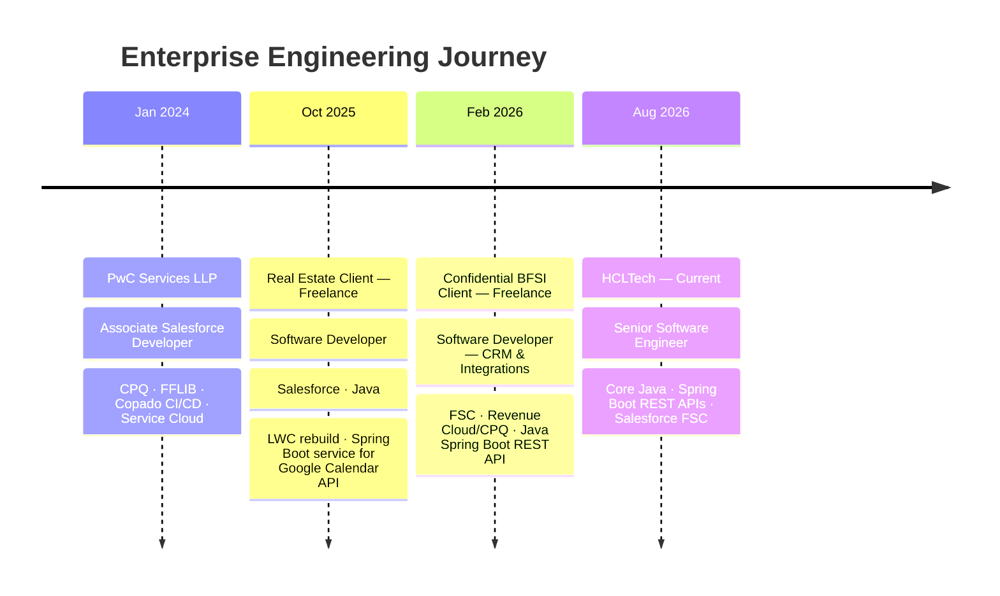
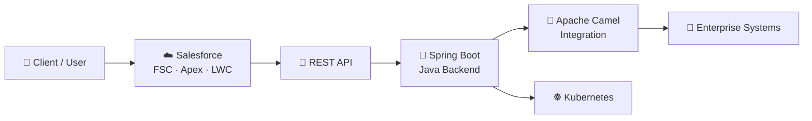

<div align="center">


### `◉ SYSTEM ONLINE`


<br/>


<br/><br/>

<a href="#-01--identity">IDENTITY</a> •
<a href="#-02--technology-matrix">STACK</a> •
<a href="#-03--career-operations">CAREER</a> •
<a href="#-04--architecture-lab">ARCHITECTURE</a> •
<a href="#-05--certification-vault">CERTIFICATIONS</a> •
<a href="#-06--github-telemetry">TELEMETRY</a> •
<a href="#-07--network">CONNECT</a>

</div>

---

<div align="center">

`01 — IDENTITY`

# ⚡ Engineering Identity

</div>

<table>
<tr>
<td width="55%" valign="top">

### `CURRENT_ROLE`

**Senior Software Engineer @ HCLTech**

Building enterprise solutions with:

- ☕ Core Java
- 🌱 Spring Boot
- 🔌 REST APIs
- ☁️ Salesforce FSC

### `ENGINEERING PROFILE`

CRM & Integration Developer working across enterprise application development, Salesforce solutions, Java backend services and REST-based integrations.

### `CURRENT LEARNING`

`Apache Camel` · `Kubernetes` · `Agentforce`

</td>

<td width="45%" valign="top">

<div align="center">


<br/><br/>

### `BACKGROUND`

🎓 B.Tech — AI & ML  
🏢 PwC alumnus  
⏱️ 2.5+ years enterprise delivery

<br/>

📫 **kumar.adityasep17.26@gmail.com**

</div>

</td>
</tr>
</table>

---

<div align="center">

`02 — TECHNOLOGY MATRIX`

# 🧬 Tech Arsenal

</div>

### ☕ Backend Engineering

<div align="center">


<br/><br/>


</div>

### ☁️ Salesforce Engineering

<div align="center">


</div>

### 🔗 Integration & Delivery

<div align="center">


</div>

---

<div align="center">

`03 — CAREER OPERATIONS`

# 🛰️ Career Timeline

</div>



---

<div align="center">

`04 — ARCHITECTURE LAB`

# 🧠 Conceptual Engineering Architecture

</div>

> **Note:** The following represents a conceptual view of how technologies represented in this profile can interact. It is not presented as a specific production architecture.



### Engineering Layers

| Layer | Focus |
|---|---|
| CRM | Salesforce · FSC · Apex · LWC |
| Backend | Core Java · Spring Boot |
| Integration | REST APIs · Apache Camel |
| Infrastructure | Kubernetes |
| Delivery | Copado · Azure DevOps · Jira |
| Architecture | FFLIB · Enterprise CRM integrations |

---

<div align="center">

`05 — CERTIFICATION VAULT`

# 🏆 Credentials

</div>

<div align="center">


<br/><br/>


</div>

---

<div align="center">

`06 — GITHUB TELEMETRY`

# 📡 GitHub Activity

<br/>


</div>

---

<div align="center">

`07 — ENGINEERING CONSOLE`

# 💻 Runtime Identity

</div>

```java
public class AdityaKumar implements SoftwareDeveloper {

    String role =
        "Senior Software Engineer @ HCLTech";

    String stack =
        "Core Java · Spring Boot · REST APIs · Salesforce FSC";

    String learning =
        "Apache Camel · Kubernetes · Agentforce";

    public String funFact() {
        return "AI/ML grad, now writing Java by day "
             + "and Apex on the side.";
    }
}
```

---

<div align="center">

`08 — DEBUG BREAK`

# 😄 Compile-Time Humor


</div>

---

<div align="center">

`09 — NETWORK`

# 🌐 Let's Connect

<a href="https://linkedin.com/in/adityagautam17">

</a>

<a href="mailto:kumar.adityasep17.26@gmail.com">

</a>

<a href="https://github.com/aditya17-09">

</a>

<a href="https://www.salesforce.com/trailblazer/aditya1709">

</a>

<br/><br/>

`$ echo "Building the glue between systems — one API at a time."`

</div>


