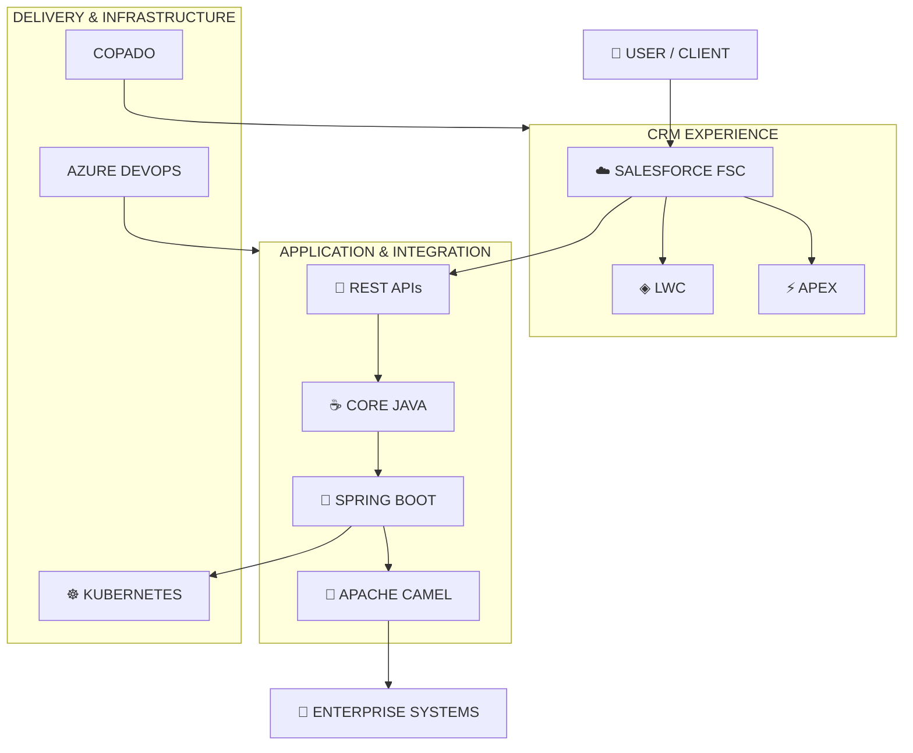

<div align="center">


<br/>

```text
┌──────────────────────────────────────────────────────────────┐
│  SYSTEM STATUS                                               │
│                                                              │
│  ● ONLINE                                                    │
│  ROLE        Senior Software Engineer @ HCLTech              │
│  CORE        Java · Spring Boot · REST APIs                  │
│  CRM         Salesforce FSC                                  │
│  FOCUS       Enterprise CRM & Integration Engineering        │
└──────────────────────────────────────────────────────────────┘
```


</div>

---

<div align="center">

### `COMMAND MENU`

`[01 IDENTITY]` · `[02 CAPABILITIES]` · `[03 CAREER]` · `[04 ARCHITECTURE]` · `[05 CREDENTIALS]` · `[06 TELEMETRY]` · `[07 NETWORK]`

</div>

---

# `01 // IDENTITY`

<table>
<tr>
<td width="33%" align="center">

### ROLE

**Senior Software Engineer**

HCLTech

</td>

<td width="33%" align="center">

### BACKEND

**Java + Spring Boot**

REST APIs

</td>

<td width="33%" align="center">

### CRM

**Salesforce FSC**

Apex · LWC

</td>
</tr>
</table>

### Operator Profile

```text
NAME             Aditya Kumar
CURRENT ROLE     Senior Software Engineer @ HCLTech
EXPERIENCE       2.5+ Years Enterprise Delivery
EDUCATION        B.Tech — AI & ML
BACKGROUND       PwC alumnus

CURRENT STACK
────────────────────────────────────────────────────────────
Core Java       ████████████████████
Spring Boot     ████████████████████
REST APIs       ████████████████████
Salesforce      ████████████████████
Integration     ████████████████░░░░
Infrastructure  ██████████████░░░░░░

CURRENT LEARNING
────────────────────────────────────────────────────────────
Apache Camel · Kubernetes · Agentforce
```

📫 **kumar.adityasep17.26@gmail.com**

---

# `02 // CAPABILITIES`

## Engineering Matrix

| SYSTEM | CAPABILITIES |
|---|---|
| `BACKEND` | Core Java · OOPs · Collections · Multithreading |
| `FRAMEWORK` | Spring Boot |
| `API` | REST APIs |
| `CRM` | Salesforce · FSC · Service Cloud |
| `CRM DEV` | Apex · LWC · SOQL · CPQ |
| `INTEGRATION` | Apache Camel |
| `INFRA` | Kubernetes |
| `DELIVERY` | Copado · Azure DevOps · Jira |
| `ARCHITECTURE` | FFLIB |
| `LANGUAGES` | Java · Python · JavaScript · HTML · CSS |
| `DATA` | MySQL |
| `TOOLS` | Git · Postman |

### Technology Interface

<div align="center">


<br/><br/>


</div>

---

# `03 // CAREER OPERATIONS`

```text
┌─────────────────────────────────────────────────────────────────┐
│  2024.01                                                        │
│  PWC SERVICES LLP                                               │
│  ASSOCIATE SALESFORCE DEVELOPER                                 │
│                                                                 │
│  CPQ · FFLIB · COPADO CI/CD · SERVICE CLOUD                     │
└─────────────────────────────────────────────────────────────────┘

                         ↓

┌─────────────────────────────────────────────────────────────────┐
│  2025.10                                                        │
│  REAL ESTATE CLIENT · FREELANCE                                 │
│  SOFTWARE DEVELOPER                                             │
│                                                                 │
│  SALESFORCE · JAVA                                              │
│  LWC REBUILD · SPRING BOOT SERVICE                              │
│  GOOGLE CALENDAR API                                            │
└─────────────────────────────────────────────────────────────────┘

                         ↓

┌─────────────────────────────────────────────────────────────────┐
│  2026.02                                                        │
│  CONFIDENTIAL BFSI CLIENT · FREELANCE                           │
│  SOFTWARE DEVELOPER — CRM & INTEGRATIONS                        │
│                                                                 │
│  FSC · REVENUE CLOUD/CPQ                                       │
│  JAVA · SPRING BOOT REST API                                    │
└─────────────────────────────────────────────────────────────────┘

                         ↓

┌─────────────────────────────────────────────────────────────────┐
│  2026.08                                                        │
│  HCLTECH                                                        │
│  SENIOR SOFTWARE ENGINEER                                      │
│                                                                 │
│  CORE JAVA · SPRING BOOT REST APIs · SALESFORCE FSC             │
└─────────────────────────────────────────────────────────────────┘
```

---

# `04 // ARCHITECTURE LAB`

## Conceptual Engineering Architecture

> Conceptual representation based on the technologies listed in this profile.



### Architecture Domains

<div align="center">

| CRM | BACKEND | INTEGRATION | DELIVERY |
|:---:|:---:|:---:|:---:|
| Salesforce | Java | REST APIs | Copado |
| FSC | Spring Boot | Apache Camel | Azure DevOps |
| Apex | Multithreading | Enterprise Integration | Jira |
| LWC | Collections | APIs | Kubernetes |

</div>

---

# `05 // CREDENTIAL VAULT`

<div align="center">

```text
┌─────────────────────────────────────────────────────┐
│                  SALESFORCE                         │
├─────────────────────────────────────────────────────┤
│  PLATFORM DEVELOPER I                               │
│  AGENTFORCE SPECIALIST                              │
│  AI ASSOCIATE                                       │
└─────────────────────────────────────────────────────┘
```


<br/><br/>

```text
┌─────────────────────────────────────────────────────┐
│                    COPADO                           │
├─────────────────────────────────────────────────────┤
│  FUNDAMENTALS I                                     │
│  FUNDAMENTALS II                                    │
└─────────────────────────────────────────────────────┘
```


</div>

---

# `06 // GITHUB TELEMETRY`

<div align="center">

```text
┌─────────────────────────────────────────────────────────────┐
│                    GITHUB TELEMETRY                         │
│                                                             │
│                 ACTIVITY MONITORING                         │
└─────────────────────────────────────────────────────────────┘
```


</div>

---

# `07 // ENGINEERING CONSOLE`

## Runtime

```java
public class AdityaKumar implements SoftwareDeveloper {

    String role =
        "Senior Software Engineer @ HCLTech";

    String stack =
        "Core Java · Spring Boot · REST APIs · Salesforce FSC";

    String learning =
        "Apache Camel · Kubernetes · Agentforce";

    public String funFact() {
        return "AI/ML grad, now writing Java by day "
             + "and Apex on the side.";
    }
}
```

### Process Monitor

```text
JAVA RUNTIME ............... ACTIVE
SPRING BOOT ................ ACTIVE
REST API LAYER ............. ACTIVE
SALESFORCE FSC ............. ACTIVE
APACHE CAMEL ............... LEARNING
KUBERNETES ................. LEARNING
AGENTFORCE ................. LEARNING

STATUS ..................... READY
```

---

# `08 // DEBUG BREAK`

<div align="center">

### `// Random developer humor detected`


</div>

---

# `09 // NETWORK`

<div align="center">

```text
$ connect --linkedin
$ connect --github
$ connect --trailhead
$ connect --email
```

<br/>

<a href="https://linkedin.com/in/adityagautam17">

</a>

<a href="https://github.com/aditya17-09">

</a>

<a href="https://www.salesforce.com/trailblazer/aditya1709">

</a>

<a href="mailto:kumar.adityasep17.26@gmail.com">

</a>

<br/><br/>

```text
────────────────────────────────────────────────────────────
SYSTEM MESSAGE

Building the glue between systems — one API at a time.

────────────────────────────────────────────────────────────
```

</div>


