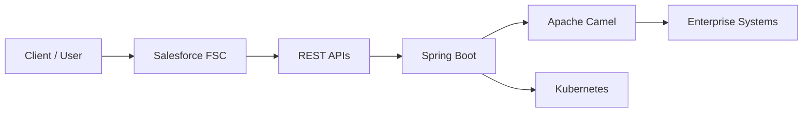

<div align="center">

# ADITYA KUMAR

### Senior Software Engineer @ HCLTech

**Core Java · Spring Boot · REST APIs · Salesforce FSC**

<br/>


&nbsp;

&nbsp;


<br/><br/>

[About](#about) · [Stack](#stack) · [Career](#career) · [Architecture](#architecture) · [Credentials](#credentials) · [Connect](#connect)

</div>

---

<a id="about"></a>

## About

<table>
<tr>
<td width="50%" valign="top">

### Senior Software Engineer

Currently at **HCLTech**, working across:

- Core Java
- Spring Boot
- REST APIs
- Salesforce FSC

</td>

<td width="50%" valign="top">

### Engineering Background

**2.5+ years** of enterprise delivery.

🎓 B.Tech — AI & ML  
🏢 PwC alumnus

Currently exploring:

`Apache Camel` · `Kubernetes` · `Agentforce`

</td>
</tr>
</table>

> **Building the glue between systems — one API at a time.**

📫 `kumar.adityasep17.26@gmail.com`

---

<a id="stack"></a>

## Stack

### Languages & Core

<p>

</p>

| Area | Technologies |
|---|---|
| **Java** | Core Java · OOPs · Collections · Multithreading |
| **Backend** | Spring Boot · REST APIs |
| **CRM** | Salesforce · FSC · Service Cloud |
| **Salesforce Development** | Apex · LWC · SOQL · CPQ |
| **Integration** | Apache Camel |
| **Infrastructure** | Kubernetes |
| **Delivery** | Copado · Azure DevOps · Jira |
| **Architecture** | FFLIB |
| **Tools** | Git · Postman |
| **Database** | MySQL |

---

### Salesforce

<p align="center">


</p>

---

<a id="career"></a>

## Career

```text
2024 ──────────────────────────────────────────────────────────────

PwC Services LLP
Associate Salesforce Developer

CPQ · FFLIB · Copado CI/CD · Service Cloud


2025 ──────────────────────────────────────────────────────────────

Real Estate Client · Freelance
Software Developer

Salesforce · Java
LWC rebuild · Spring Boot service for Google Calendar API


2026 ──────────────────────────────────────────────────────────────

Confidential BFSI Client · Freelance
Software Developer — CRM & Integrations

FSC · Revenue Cloud/CPQ · Java Spring Boot REST API


2026 ──────────────────────────────────────────────────────────────

HCLTech · Current
Senior Software Engineer

Core Java · Spring Boot REST APIs · Salesforce FSC
```

---

<a id="architecture"></a>

## Architecture

### Conceptual Engineering Flow



### Engineering Philosophy

<table>
<tr>
<td align="center" width="25%">

**01**

### CRM

Salesforce  
FSC · Apex · LWC

</td>

<td align="center" width="25%">

**02**

### Backend

Java  
Spring Boot

</td>

<td align="center" width="25%">

**03**

### Integration

REST APIs  
Apache Camel

</td>

<td align="center" width="25%">

**04**

### Delivery

Kubernetes  
Copado · ADO

</td>
</tr>
</table>

---

<a id="credentials"></a>

## Credentials

<div align="center">

### Salesforce


### Copado


</div>

---

## GitHub Activity

<div align="center">


</div>

---

## Engineering Console

```java
public class AdityaKumar implements SoftwareDeveloper {

    private final String role =
        "Senior Software Engineer @ HCLTech";

    private final String stack =
        "Core Java · Spring Boot · REST APIs · Salesforce FSC";

    private final String learning =
        "Apache Camel · Kubernetes · Agentforce";

    public String funFact() {
        return "AI/ML grad, now writing Java by day "
             + "and Apex on the side.";
    }
}
```

---

## Developer Break

<div align="center">


</div>

---

<a id="connect"></a>

## Connect

<div align="center">

<a href="https://linkedin.com/in/adityagautam17">

</a>

<a href="https://github.com/aditya17-09">

</a>

<a href="https://www.salesforce.com/trailblazer/aditya1709">

</a>

<a href="mailto:kumar.adityasep17.26@gmail.com">

</a>

<br/><br/>

**CRM × Backend × Integration**

<sub>Building enterprise software where systems meet.</sub>

</div>

---

<div align="center">


</div>
