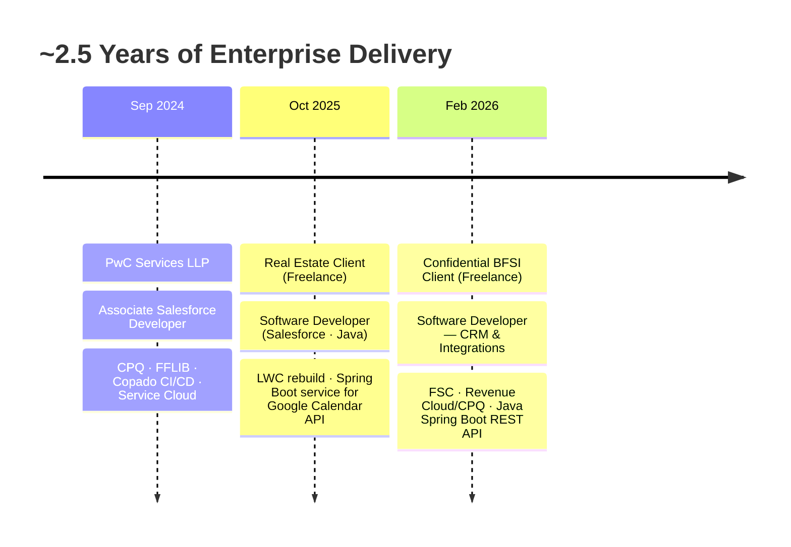

<!-- ═══════════════════ ANIMATED GRADIENT HEADER ═══════════════════ -->
<div align="center">
  
</div>

<!-- ═══════════════════ TYPING ANIMATION ═══════════════════ -->
<div align="center">
  <a href="https://github.com/aditya17-09">
    
  </a>
</div>

<div align="center">
  
  
  
</div>

<br/>

<!-- ═══════════════════ RAINBOW DIVIDER ═══════════════════ -->


<!-- ═══════════════════ ABOUT ME ═══════════════════ -->
## 🚀 About Me

<table>
<tr>
<td width="58%" valign="top">

- 🔭 Building **enterprise Salesforce FSC solutions** for a BFSI client — Apex, LWC & Revenue Cloud/CPQ, extended with **Java Spring Boot REST APIs**
- 🌱 Currently learning **Apache Camel & Kubernetes** for enterprise integration and deployment, alongside **Agentforce & Einstein AI**
- 🧠 Using **AI-assisted development tools** daily to speed up coding, reviews, and debugging
- 👯 Open to collaborating on **Salesforce + Java integrations** and **AI-powered CRM automation**
- 💬 Ask me about **Apex · LWC · CPQ · FSC · Salesforce–Spring Boot integrations · FFLIB · Copado**
- ⚡ Fun fact: graduated in **AI & ML** — ended up automating the world's #1 CRM. The robots and the salespeople need each other 😄
- 📫 **kumar.adityasep17.26@gmail.com**

</td>
<td width="42%" align="center" valign="middle">


</td>
</tr>
</table>


<!-- ═══════════════════ TECH STACK ═══════════════════ -->
## 🛠️ Tech Arsenal

<div align="center">

### Core Stack


### Tools & Workflow


### ☁️ Salesforce Ecosystem


### 🔗 Integration & Delivery


</div>


<!-- ═══════════════════ CAREER TIMELINE ═══════════════════ -->
## 🧭 Career Timeline




<!-- ═══════════════════ CERTIFICATIONS ═══════════════════ -->
## 🏆 Certifications

<div align="center">


<br/>


</div>


<!-- ═══════════════════ WHAT I BUILD ═══════════════════ -->
## 🧩 What I Actually Build

```java
public class AdityaKumar implements SoftwareDeveloper {

    String currentFocus   = "BFSI · Financial Services Cloud · Revenue Cloud";
    String integrations   = "Java · Spring Boot REST APIs · Apex Callouts";
    String architecture   = "FFLIB · Separation of Concerns · Trigger Frameworks";
    String delivery       = "Copado CI/CD · Azure DevOps · Agile Sprints";
    String learning       = "Apache Camel · Kubernetes · Agentforce";
    String background     = "B.Tech AI & ML · PwC Alumnus · 2.5 YOE";

    public String funFact() {
        return "Graduated in AI/ML. Ended up automating CRMs. No regrets. 🚀";
    }
}
```


<!-- ═══════════════════ QUEST LOG ═══════════════════ -->
🎯 Current Quest Log

<div align="center">
SkillProgressStatus⚡ Apex & LWC▓▓▓▓▓▓▓▓░░Shipping to prod since 2024☕ Java + Spring Boot▓▓▓▓▓▓░░░░REST APIs up & running🛤️ Apache Camel▓▓▓▓░░░░░░Routing my way through🚢 Kubernetes▓▓▓░░░░░░░Containers ≠ Tupperware (learned that the hard way)🤖 Agentforce & Einstein AI▓▓▓▓▓░░░░░Teaching bots to do the busywork

</div>
📟 Runtime Stats

console$ aditya --status --verbose

  ☕ Coffee consumed this sprint........... 14 cups (1 per standup, 2 per deployment)
  🚀 Copado deployments.................... ✅ passed (on the 2nd try — that counts)
  ⚠️ Governor limits respected............. mostly.
  🔁 "Works in sandbox" incidents.......... 12 and counting
  🧠 AI pair-programming sessions.......... daily — the robot never asks for coffee
  📅 Sprint velocity....................... stable | mood: [████████░░] caffeinated

$ _


<!-- ═══════════════════ CONNECT ═══════════════════ -->
## 🌐 Let's Connect

<div align="center">

<a href="https://linkedin.com/in/adityagautam17"></a>
&nbsp;
<a href="mailto:kumar.adityasep17.26@gmail.com"></a>
&nbsp;
<a href="https://github.com/aditya17-09"></a>
&nbsp;
<a href="https://www.salesforce.com/trailblazer/aditya1709"></a>

<br/><br/>

<i>"From Apex triggers to Spring Boot services — building the glue between systems. 🚀"</i>

</div>

<!-- ═══════════════════ FOOTER WAVE ═══════════════════ -->
<div align="center">
  
</div>
