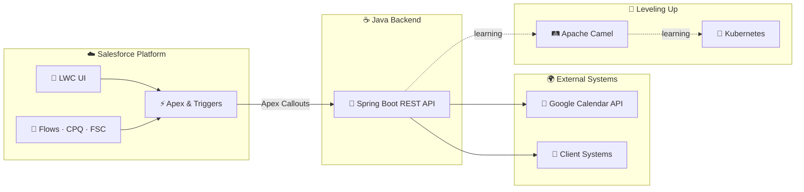
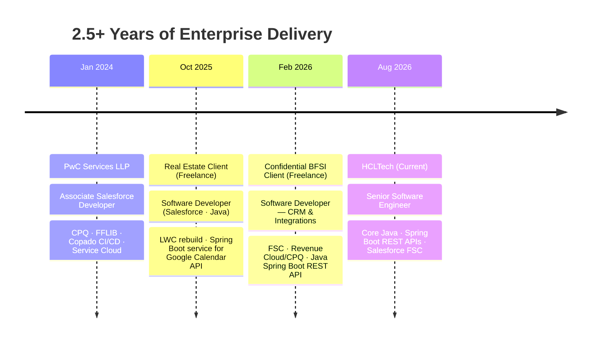

<!-- ═══════════════════════════════════════════════════════════════
     HERO
═══════════════════════════════════════════════════════════════ -->
<div align="center">


<a href="https://github.com/aditya17-09">
  
</a>

<sub>Core Java · Spring Boot · Salesforce FSC — with a growing focus on Agentforce &amp; applied AI</sub>

<br/><br/>


<a href="https://github.com/aditya17-09"></a>
<a href="https://linkedin.com/in/adityagautam17"></a>


<br/><br/>


<br/><br/>

<a href="#-current-focus">Focus</a> &nbsp;//&nbsp;
<a href="#-about">About</a> &nbsp;//&nbsp;
<a href="#-tech-universe">Tech</a> &nbsp;//&nbsp;
<a href="#-featured-projects">Projects</a> &nbsp;//&nbsp;
<a href="#-architecture--how-it-works">Architecture</a> &nbsp;//&nbsp;
<a href="#-github-statistics">Stats</a> &nbsp;//&nbsp;
<a href="#-connect-with-me">Connect</a>

</div>


<!-- ═══════════════════════════════════════════════════════════════
     SYSTEM STATUS / CURRENT FOCUS
═══════════════════════════════════════════════════════════════ -->

## 🛰️ Current Focus

```text
┌──────────────────────────────────────────────────────────────────┐
│  SYSTEM STATUS                                            ● LIVE  │
├──────────────────────────────────────────────────────────────────┤
│  ROLE       Senior Software Engineer @ HCLTech                    │
│  BUILDING   REST APIs · Core Java · Spring Boot                   │
│  ALSO ON    Salesforce FSC · Apex · LWC · Revenue Cloud/CPQ       │
│  LEARNING   Apache Camel · Kubernetes · Agentforce                │
│  UPTIME     2.5+ years enterprise delivery                        │
└──────────────────────────────────────────────────────────────────┘
```


<!-- ═══════════════════════════════════════════════════════════════
     ABOUT
═══════════════════════════════════════════════════════════════ -->

## 👤 About

<table>
<tr>
<td width="60%" valign="middle">

I build the backend and CRM systems that connect enterprise software — REST APIs, Salesforce automation, and the integrations that let them talk to each other.

- ☕ **Senior Software Engineer at HCLTech** — REST APIs with Core Java & Spring Boot
- ⚡ Salesforce FSC development — Apex, LWC, Revenue Cloud/CPQ
- 🌱 Leveling up on Apache Camel, Kubernetes & Agentforce
- 🎓 B.Tech in AI & ML · PwC alumnus · 2.5+ years in enterprise delivery
- 📫 **kumar.adityasep17.26@gmail.com**

</td>
<td width="40%" align="center">


</td>
</tr>
</table>


<!-- ═══════════════════════════════════════════════════════════════
     TECH UNIVERSE
═══════════════════════════════════════════════════════════════ -->

## 🌌 Tech Universe

<div align="center">

</div>

<br/>

<details open>
<summary><b>☁️ Salesforce Galaxy</b></summary>
<br/>

<div align="center">


</div>

</details>

<details>
<summary><b>☕ Backend Core</b></summary>
<br/>

<div align="center">


</div>

</details>

<details>
<summary><b>🔗 Integration &amp; Delivery</b></summary>
<br/>

<div align="center">


</div>

</details>

<details>
<summary><b>🧠 AI &amp; ML Foundation</b></summary>
<br/>

<div align="center">


</div>

</details>


<!-- ═══════════════════════════════════════════════════════════════
     FEATURED PROJECTS
═══════════════════════════════════════════════════════════════ -->

## 🚀 Featured Projects

<table width="100%">
<tr><td>

### 🏠 Real Estate CRM &amp; Calendar Integration
<sub>Freelance · Oct 2025</sub>

| | |
|---|---|
| **Problem** | Client needed the Salesforce front end modernized and a way to keep Salesforce and Google Calendar in sync. |
| **Solution** | Rebuilt the Lightning Web Components UI and built a Spring Boot service that bridges Salesforce to the Google Calendar API. |
| **Technology** | `Salesforce LWC` `Java` `Spring Boot` `Google Calendar API` |
| **Result** | *Private client engagement — metrics not publicly disclosed* |
| **Links** | *Private repository — available on request* |

</td></tr>
</table>

<br/>

<table width="100%">
<tr><td>

### 🏦 BFSI CRM &amp; Integration Platform
<sub>Freelance · Feb 2026</sub>

| | |
|---|---|
| **Problem** | Confidential BFSI client needed CRM and Revenue Cloud capabilities connected to backend systems via API. |
| **Solution** | Delivered Salesforce Financial Services Cloud (FSC) and Revenue Cloud/CPQ configuration, extended with Java Spring Boot REST APIs. |
| **Technology** | `Salesforce FSC` `Revenue Cloud/CPQ` `Java` `Spring Boot` `REST APIs` |
| **Result** | *Confidential client engagement — metrics not publicly disclosed* |
| **Links** | *Private repository — available on request* |

</td></tr>
</table>

<br/>

<table width="100%">
<tr><td>

### 🔒 Enterprise Backend Services
<sub>HCLTech · Aug 2026 — Present</sub>

| | |
|---|---|
| **Problem** | *(Confidential client engagement)* |
| **Solution** | Building and exposing REST APIs with Core Java &amp; Spring Boot, mapping data to meet client requirements. |
| **Technology** | `Core Java` `Spring Boot` `REST APIs` `Salesforce FSC` |
| **Result** | *In progress — role started August 2026* |
| **Links** | *Confidential — no public repository* |

</td></tr>
</table>


<!-- ═══════════════════════════════════════════════════════════════
     ARCHITECTURE
═══════════════════════════════════════════════════════════════ -->

## 🏗️ Architecture / How It Works

<sub>How the pieces of my typical stack fit together</sub>




<!-- ═══════════════════════════════════════════════════════════════
     TIMELINE
═══════════════════════════════════════════════════════════════ -->

## 🧭 Career Timeline




<!-- ═══════════════════════════════════════════════════════════════
     GITHUB STATISTICS + CONTRIBUTION ACTIVITY
═══════════════════════════════════════════════════════════════ -->

## 📊 GitHub Statistics

<div align="center">


</div>

**Contribution Activity**

<div align="center">

</div>


<!-- ═══════════════════════════════════════════════════════════════
     CERTIFICATIONS
═══════════════════════════════════════════════════════════════ -->

## 🏆 Certifications &amp; Achievements

<div align="center">


<br/>


</div>


<!-- ═══════════════════════════════════════════════════════════════
     CONNECT
═══════════════════════════════════════════════════════════════ -->

## 📡 Connect With Me

<div align="center">

<a href="https://linkedin.com/in/adityagautam17"></a>
&nbsp;
<a href="mailto:kumar.adityasep17.26@gmail.com"></a>
&nbsp;
<a href="https://github.com/aditya17-09"></a>
&nbsp;
<a href="https://www.salesforce.com/trailblazer/aditya1709"></a>

<br/><br/>

<sub><i>Building the glue between systems — one API at a time.</i></sub>

</div>

<!-- ═══════════════════════════════════════════════════════════════
     FOOTER
═══════════════════════════════════════════════════════════════ -->


