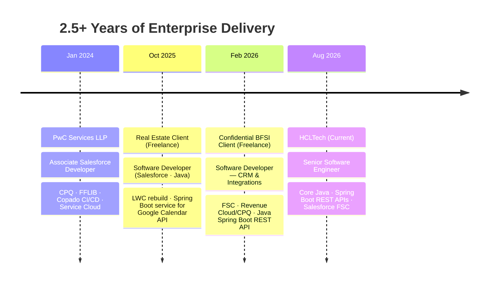

<!-- ═══════════════════ HEADER ═══════════════════ -->
<div align="center">
  
</div>

<div align="center">
  <a href="https://github.com/aditya17-09">
    
  </a>
</div>

<div align="center">


<br/><br/>

<a href="#-about-me">About</a> &nbsp;/&nbsp;
<a href="#-tech-arsenal">Stack</a> &nbsp;/&nbsp;
<a href="#-career-timeline">Timeline</a> &nbsp;/&nbsp;
<a href="#-github-stats">Stats</a> &nbsp;/&nbsp;
<a href="#-lets-connect">Connect</a>

</div>


<!-- ═══════════════════ ABOUT ═══════════════════ -->
<div align="center"><sub><b>01 — INTRODUCTION</b></sub></div>

## 🚀 About Me

<table>
<tr>
<td width="60%" valign="middle">

- ☕ **Senior Software Engineer at HCLTech** — building REST APIs with **Core Java & Spring Boot**
- ⚡ Also build **Salesforce FSC** solutions — Apex, LWC, Revenue Cloud/CPQ
- 🌱 Learning **Apache Camel, Kubernetes & Agentforce**
- 🎓 B.Tech AI & ML · PwC alumnus · 2.5+ years in enterprise delivery
- 📫 **kumar.adityasep17.26@gmail.com**

</td>
<td width="40%" align="center">


</td>
</tr>
</table>


<!-- ═══════════════════ STACK ═══════════════════ -->
<div align="center"><sub><b>02 — STACK</b></sub></div>

## 🛠️ Tech Arsenal

<div align="center">


<br/><br/>

**Salesforce**
<br/>


<br/><br/>

**Backend**
<br/>


<br/><br/>

**Delivery**
<br/>


</div>


<!-- ═══════════════════ TIMELINE ═══════════════════ -->
<div align="center"><sub><b>03 — TIMELINE</b></sub></div>

## 🧭 Career Timeline




<!-- ═══════════════════ STATS ═══════════════════ -->
<div align="center"><sub><b>04 — STATS</b></sub></div>

## 📊 GitHub Stats

<div align="center">


</div>


<!-- ═══════════════════ CERTIFICATIONS ═══════════════════ -->
<div align="center"><sub><b>05 — CERTIFICATIONS</b></sub></div>

## 🏆 Certifications

<div align="center">


<br/>


</div>


<!-- ═══════════════════ BUILD ═══════════════════ -->
<div align="center"><sub><b>06 — BUILD</b></sub></div>

## 🧩 What I Actually Build

```java
public class AdityaKumar implements SoftwareDeveloper {
    String role     = "Senior Software Engineer @ HCLTech";
    String stack    = "Core Java · Spring Boot · REST APIs · Salesforce FSC";
    String learning = "Apache Camel · Kubernetes · Agentforce";

    public String funFact() {
        return "AI/ML grad, now writing Java by day and Apex on the side.";
    }
}
```


<!-- ═══════════════════ HUMOR ═══════════════════ -->
<div align="center"><sub><b>07 — A SHORT BREAK</b></sub></div>

## 😄 Compile-Time Humor

<div align="center">


</div>


<!-- ═══════════════════ CONNECT ═══════════════════ -->
<div align="center"><sub><b>08 — CONNECT</b></sub></div>

## 🌐 Let's Connect

<div align="center">

<a href="https://linkedin.com/in/adityagautam17"></a>
&nbsp;
<a href="mailto:kumar.adityasep17.26@gmail.com"></a>
&nbsp;
<a href="https://github.com/aditya17-09"></a>
&nbsp;
<a href="https://www.salesforce.com/trailblazer/aditya1709"></a>

<br/><br/>

<sub><i>Building the glue between systems — one API at a time.</i></sub>

</div>

<!-- ═══════════════════ FOOTER ═══════════════════ -->

