<div align="center">


### `◉ SYSTEM ONLINE`


<br/>


<br/><br/>

<a href="#identity">IDENTITY</a> •
<a href="#stack">STACK</a> •
<a href="#career">CAREER</a> •
<a href="#architecture">ARCHITECTURE</a> •
<a href="#certifications">CERTIFICATIONS</a> •
<a href="#telemetry">TELEMETRY</a> •
<a href="#connect">CONNECT</a>

</div>

---

<a id="identity"></a>
<div align="center">

`01 — IDENTITY`

# ⚡ Engineering Identity

</div>

<table>
<tr>
<td width="55%" valign="top">

### `CURRENT_ROLE`

**Senior Software Engineer @ HCLTech**

Building enterprise solutions with:

- ☕ Core Java
- 🌱 Spring Boot
- 🔌 REST APIs
- ☁️ Salesforce FSC

### `ENGINEERING PROFILE`

CRM & Integration Developer working across enterprise application development, Salesforce solutions, Java backend services and REST-based integrations.

### `CURRENT LEARNING`

`Apache Camel` · `Kubernetes` · `Agentforce`

</td>

<td width="45%" valign="top">

<div align="center">


<br/><br/>

### `BACKGROUND`

🎓 B.Tech — AI & ML  
🏢 PwC alumnus  
⏱️ 2.5+ years enterprise delivery

<br/>

📫 **kumar.adityasep17.26@gmail.com**

</div>

</td>
</tr>
</table>

---

<a id="stack"></a>
<div align="center">

`02 — TECHNOLOGY MATRIX`

# 🧬 Tech Arsenal

</div>

### ☕ Backend Engineering

<div align="center">


<br/><br/>


</div>

### ☁️ Salesforce Engineering

<div align="center">


</div>

### 🔗 Integration & Delivery

<div align="center">


</div>

---

<a id="career"></a>
<div align="center">

`03 — CAREER OPERATIONS`

# 🛰️ Mission Log

<sub>`$ git log --career --reverse-chronological`</sub>

</div>

<br/>

<table>
<tr>
<td width="22%" align="center" valign="middle">


<br/>

🟢 **`HEAD → main`**

</td>
<td width="78%" valign="top">

### 🏢 HCLTech
**Senior Software Engineer**

> Building enterprise backend services and CRM integrations for large-scale clients.


</td>
</tr>

<tr>
<td align="center" valign="middle">


<br/>

🔵 **`freelance`**

</td>
<td valign="top">

### 🏦 Confidential BFSI Client
**Software Developer — CRM & Integrations**

> Delivered FSC and Revenue Cloud/CPQ solutions backed by a Java Spring Boot REST API layer.


</td>
</tr>

<tr>
<td align="center" valign="middle">


<br/>

🔵 **`freelance`**

</td>
<td valign="top">

### 🏠 Real Estate Client
**Software Developer**

> Rebuilt the LWC front end and shipped a Spring Boot service integrating the Google Calendar API.


</td>
</tr>

<tr>
<td align="center" valign="middle">


<br/>

⚪ **`init commit`**

</td>
<td valign="top">

### 💼 PwC Services LLP
**Associate Salesforce Developer**

> Enterprise Salesforce delivery on CPQ and Service Cloud using FFLIB patterns and Copado CI/CD.


</td>
</tr>
</table>

---

<a id="architecture"></a>
<div align="center">

`04 — ARCHITECTURE LAB`

# 🏦 Core Banking Integration Blueprint

</div>

> **Note:** A conceptual view of how the Java, Spring Boot, Apache Camel and Kubernetes skills in this profile fit into a core banking landscape. It is not a specific production architecture.

```mermaid
flowchart LR
    subgraph CH["📱 Digital Channels"]
        direction TB
        MB["Mobile Banking"]
        IB["Internet Banking"]
        BR["Branch / Teller"]
    end

    GW["🛡️ API Gateway<br/>OAuth2 · Rate Limiting"]

    subgraph MS["🌱 Spring Boot Microservices"]
        direction TB
        ACC["Accounts & Deposits"]
        PAY["Payments & Transfers"]
        LN["Loans & Lending"]
        CIF["Customer · KYC"]
    end

    CAMEL["🔗 Apache Camel<br/>Routing · Transformation<br/>ISO 20022 · ISO 8583"]

    CBS[("🏦 Core Banking System<br/>General Ledger · CASA")]
    RAILS["💸 Payment Rails<br/>UPI · NEFT · RTGS · SWIFT"]
    EXT["🧾 External Services<br/>Credit Bureau · AML"]

    K8S["☸️ Kubernetes<br/>Scaling · Self-healing"]

    CH -->|HTTPS / REST| GW
    GW --> MS
    MS -->|events · requests| CAMEL
    CAMEL --> CBS
    CAMEL --> RAILS
    CAMEL --> EXT
    K8S -. orchestrates .-> MS

    classDef channel fill:#0f172a,stroke:#00A1E0,color:#ffffff
    classDef gateway fill:#326CE5,stroke:#1e3a8a,color:#ffffff
    classDef service fill:#6DB33F,stroke:#3f6d22,color:#ffffff
    classDef integ fill:#E97826,stroke:#9a4a10,color:#ffffff
    classDef core fill:#050816,stroke:#FFD700,stroke-width:3px,color:#FFD700
    classDef ext fill:#1a1b27,stroke:#7B8794,color:#ffffff
    classDef infra fill:#326CE5,stroke:#ffffff,stroke-dasharray:4 3,color:#ffffff

    class MB,IB,BR channel
    class GW gateway
    class ACC,PAY,LN,CIF service
    class CAMEL integ
    class CBS core
    class RAILS,EXT ext
    class K8S infra
```



### Engineering Layers

| Layer | Responsibility | Tech |
|---|---|---|
| 📱 Channels | Customer touchpoints | Mobile · Web · Branch |
| 🛡️ API | Secure entry, auth, throttling | REST · OAuth2 |
| 🌱 Services | Domain logic per banking product | Core Java · Spring Boot |
| 🔗 Integration | Routing, mapping, message standards | Apache Camel · ISO 20022 / 8583 |
| 🏦 System of Record | Ledger, CASA, balances | Core Banking System |
| ☸️ Infrastructure | Deployment, scaling, resilience | Kubernetes |
| 🚀 Delivery | CI/CD and work tracking | Azure DevOps · Jira |

---

<a id="certifications"></a>
<div align="center">

`05 — CERTIFICATION VAULT`

# 🏆 Credentials

</div>

<div align="center">


<br/><br/>


</div>

---

<a id="telemetry"></a>
<div align="center">

`06 — GITHUB TELEMETRY`

# 📡 Contribution Pulse

<br/>


</div>

---

<div align="center">

`07 — ENGINEERING CONSOLE`

# 💻 Runtime Identity

</div>

```java
public class AdityaKumar implements SoftwareDeveloper {

    String role =
        "Senior Software Engineer @ HCLTech";

    String stack =
        "Core Java · Spring Boot · REST APIs · Salesforce FSC";

    String learning =
        "Apache Camel · Kubernetes · Agentforce";

    public String funFact() {
        return "AI/ML grad, now writing Java by day "
             + "and Apex on the side.";
    }
}
```

---

<div align="center">

`08 — DEBUG BREAK`

# 😄 Compile-Time Humor


</div>

---

<a id="connect"></a>
<div align="center">

`09 — NETWORK`

# 🌐 Let's Connect

<a href="https://linkedin.com/in/adityagautam17">

</a>

<a href="mailto:kumar.adityasep17.26@gmail.com">

</a>

<a href="https://github.com/aditya17-09">

</a>

<a href="https://www.salesforce.com/trailblazer/aditya1709">

</a>

<br/><br/>

`$ echo "Building the glue between systems — one API at a time."`

</div>


