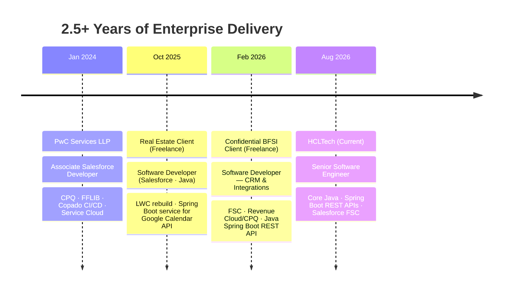
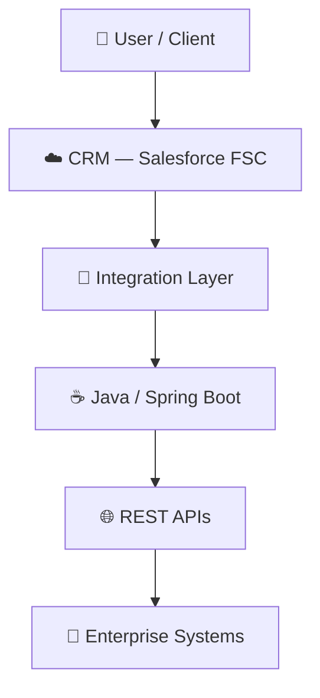

<!-- ═══════════════════════════════════════════════════════════════
     HERO
═══════════════════════════════════════════════════════════════ -->

<br/>

<div align="center">

<sub>⬡&nbsp;&nbsp;SYSTEMS ENGINEER PORTFOLIO</sub>

# ADITYA KUMAR

**Senior Software Engineer @ HCLTech**

Core Java · Spring Boot · REST APIs · Salesforce FSC

<sub>🟢 ENGINEERING SYSTEMS ONLINE</sub>

<br/>

<a href="https://github.com/aditya17-09"></a>
<a href="https://linkedin.com/in/adityagautam17"></a>
<a href="https://www.salesforce.com/trailblazer/aditya1709"></a>
<a href="mailto:kumar.adityasep17.26@gmail.com"></a>

</div>

<br/>


<!-- ═══════════════════════════════════════════════════════════════
     PROFILE DASHBOARD
═══════════════════════════════════════════════════════════════ -->

<br/>

<sub><b>PROFILE DASHBOARD</b></sub>

## Profile Dashboard

<table width="100%">
<tr><td>

|  |  |
|---|---|
| **CURRENT ROLE** | HCLTech — Senior Software Engineer |
| **PRIMARY STACK** | Java · Spring Boot |
| **CRM** | Salesforce FSC |
| **INTEGRATION** | REST APIs · Apache Camel |
| **INFRASTRUCTURE** | Kubernetes |
| **EXPERIENCE** | 2.5+ years enterprise delivery |

</td></tr>
</table>

<br/>


<!-- ═══════════════════════════════════════════════════════════════
     ENGINEERING STACK
═══════════════════════════════════════════════════════════════ -->

<br/>

<sub><b>ENGINEERING STACK</b></sub>

## Engineering Stack

<br/>

**01 — LANGUAGES**


<br/><br/>

**02 — BACKEND**


<br/><br/>

**03 — CRM (SALESFORCE)**


<br/><br/>

**04 — INTEGRATION**


<br/><br/>

**05 — DEVOPS / INFRASTRUCTURE**


<br/><br/>

**06 — TOOLING**


<br/><br/>


<!-- ═══════════════════════════════════════════════════════════════
     CAREER
═══════════════════════════════════════════════════════════════ -->

<br/>

<sub><b>CAREER JOURNEY</b></sub>

## Career



<br/>

<table width="100%">
<tr><td>

**HCLTech** — Senior Software Engineer
<sub>Aug 2026 — Present</sub>

Building and exposing REST APIs with Core Java & Spring Boot, mapping data to meet client requirements. Also contributing to Salesforce FSC work.

`Core Java` `Spring Boot` `REST APIs` `Salesforce FSC`

</td></tr>
</table>

<table width="100%">
<tr><td>

**Confidential BFSI Client** — Software Developer, CRM & Integrations <sub>(Freelance)</sub>
<sub>Feb 2026 — Aug 2026</sub>

Delivered Salesforce Financial Services Cloud and Revenue Cloud/CPQ configuration, extended with Java Spring Boot REST APIs.

`Salesforce FSC` `Revenue Cloud/CPQ` `Java` `Spring Boot` `REST APIs`

</td></tr>
</table>

<table width="100%">
<tr><td>

**Real Estate Client** — Software Developer, Salesforce & Java <sub>(Freelance)</sub>
<sub>Oct 2025 — Feb 2026</sub>

Rebuilt the Lightning Web Components UI and built a Spring Boot service bridging Salesforce to the Google Calendar API.

`Salesforce LWC` `Java` `Spring Boot` `Google Calendar API`

</td></tr>
</table>

<table width="100%">
<tr><td>

**PwC Services LLP** — Associate Salesforce Developer
<sub>Jan 2024 — Oct 2025</sub>

Delivered CPQ implementations and Service Cloud solutions using the FFLIB enterprise architecture pattern, with Copado for CI/CD.

`CPQ` `FFLIB` `Copado CI/CD` `Service Cloud`

</td></tr>
</table>

<br/>

<sub>🎓 B.Tech, Artificial Intelligence &amp; Machine Learning</sub>

<br/><br/>


<!-- ═══════════════════════════════════════════════════════════════
     ENGINEERING ARCHITECTURE
═══════════════════════════════════════════════════════════════ -->

<br/>

<sub><b>ENGINEERING ARCHITECTURE</b></sub>

## Engineering Architecture

<sub>⚠ Conceptual architecture — an illustrative representation of the systems described in this profile, not a diagram of any single deployed system.</sub>

<br/>



<br/>


<!-- ═══════════════════════════════════════════════════════════════
     CERTIFICATIONS
═══════════════════════════════════════════════════════════════ -->

<br/>

<sub><b>CREDENTIALS</b></sub>

## Certifications

<table width="100%">
<tr>
<td width="33%" align="center">

🏅 **Salesforce**
<br/>Platform Developer I

</td>
<td width="33%" align="center">

🏅 **Salesforce**
<br/>Agentforce Specialist

</td>
<td width="33%" align="center">

🏅 **Salesforce**
<br/>AI Associate

</td>
</tr>
<tr>
<td width="33%" align="center">

🏅 **Copado**
<br/>Fundamentals I

</td>
<td width="33%" align="center">

🏅 **Copado**
<br/>Fundamentals II

</td>
<td width="33%"></td>
</tr>
</table>

<br/>


<!-- ═══════════════════════════════════════════════════════════════
     CODE IDENTITY
═══════════════════════════════════════════════════════════════ -->

<br/>

<sub><b>CODE IDENTITY</b></sub>

## Code Identity

<sub>`● ● ●`&nbsp;&nbsp;`AdityaKumar.java`</sub>

```java
public class AdityaKumar implements SoftwareDeveloper {
    String role     = "Senior Software Engineer @ HCLTech";
    String stack    = "Core Java · Spring Boot · REST APIs · Salesforce FSC";
    String learning = "Apache Camel · Kubernetes · Agentforce";

    public String funFact() {
        return "AI/ML grad, now writing Java by day and Apex on the side.";
    }
}
```

<br/>


<!-- ═══════════════════════════════════════════════════════════════
     GITHUB ANALYTICS
═══════════════════════════════════════════════════════════════ -->

<br/>

<sub><b>GITHUB ANALYTICS</b></sub>

## GitHub Analytics

<div align="center">


<br/>


</div>

<br/>


<!-- ═══════════════════════════════════════════════════════════════
     PERSONALITY
═══════════════════════════════════════════════════════════════ -->

<br/>

<sub><b>OFF THE CLOCK</b></sub>

<details>
<summary><b>A little personality</b></summary>

<br/>

Uses AI-assisted development tools daily — because why wouldn't you.

<div align="center">

</div>

</details>

<br/>


<!-- ═══════════════════════════════════════════════════════════════
     CONTACT
═══════════════════════════════════════════════════════════════ -->

<br/>

<div align="center">

<sub><b>CONNECT</b></sub>

<br/><br/>

<a href="https://linkedin.com/in/adityagautam17"></a>
<a href="https://github.com/aditya17-09"></a>
<a href="https://www.salesforce.com/trailblazer/aditya1709"></a>
<a href="mailto:kumar.adityasep17.26@gmail.com"></a>

<br/><br/>

<sub>Building the glue between systems — one API at a time.</sub>

</div>

<br/>
