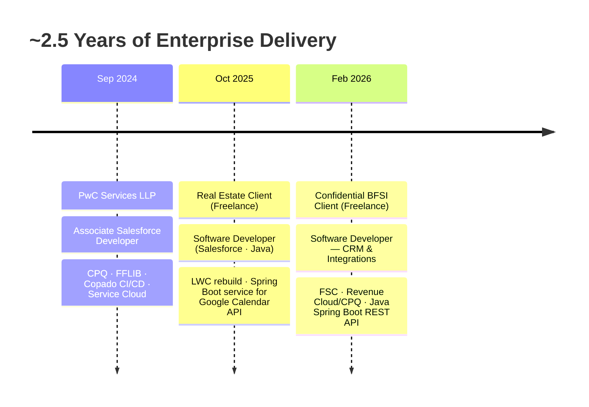

<!-- ═══════════════════ ANIMATED GRADIENT HEADER ═══════════════════ -->
<div align="center">
  
</div>

<!-- ═══════════════════ TYPING ANIMATION ═══════════════════ -->
<div align="center">
  <a href="https://github.com/aditya17-09">
    
  </a>
</div>

<div align="center">
  
  
  
</div>

<br/>

<!-- ═══════════════════ RAINBOW DIVIDER ═══════════════════ -->


<!-- ═══════════════════ ABOUT ME ═══════════════════ -->
## 🚀 About Me

<table>
<tr>
<td width="58%" valign="top">

- 🔭 Building **enterprise Salesforce FSC solutions** for a BFSI client — Apex, LWC & Revenue Cloud/CPQ, extended with **Java Spring Boot REST APIs**
- 🌱 Currently learning **Apache Camel & Kubernetes** for enterprise integration and deployment, alongside **Agentforce & Einstein AI**
- 🧠 Using **AI-assisted development tools** daily to speed up coding, reviews, and debugging
- 👯 Open to collaborating on **Salesforce + Java integrations** and **AI-powered CRM automation**
- 💬 Ask me about **Apex · LWC · CPQ · FSC · Salesforce–Spring Boot integrations · FFLIB · Copado**
- ⚡ Fun fact: graduated in **AI & ML** — ended up automating the world's #1 CRM. The robots and the salespeople need each other 😄
- 📫 **kumar.adityasep17.26@gmail.com**

</td>
<td width="42%" align="center" valign="middle">


</td>
</tr>
</table>


<!-- ═══════════════════ TECH STACK ═══════════════════ -->
## 🛠️ Tech Arsenal

<div align="center">

### Core Stack


### Tools & Workflow


### ☁️ Salesforce Ecosystem


### 🔗 Integration & Delivery


</div>


<!-- ═══════════════════ CAREER TIMELINE ═══════════════════ -->
## 🧭 Career Timeline




<!-- ═══════════════════ CERTIFICATIONS ═══════════════════ -->
## 🏆 Certifications

<div align="center">


<br/>


</div>


<!-- ═══════════════════ WHAT I BUILD ═══════════════════ -->
## 🧩 What I Actually Build

```java
public class AdityaKumar implements SoftwareDeveloper {

    String currentFocus   = "BFSI · Financial Services Cloud · Revenue Cloud";
    String integrations   = "Java · Spring Boot REST APIs · Apex Callouts";
    String architecture   = "FFLIB · Separation of Concerns · Trigger Frameworks";
    String delivery       = "Copado CI/CD · Azure DevOps · Agile Sprints";
    String learning       = "Apache Camel · Kubernetes · Agentforce";
    String background     = "B.Tech AI & ML · PwC Alumnus · 2.5 YOE";

    public String funFact() {
        return "Graduated in AI/ML. Ended up automating CRMs. No regrets. 🚀";
    }
}
```


<!-- ═══════════════════ SKILL UNIVERSE ═══════════════════ -->
🧠 Skill Universe

#mermaid-r1hp-r3 { font-family: "Anthropic Sans", system-ui, "Segoe UI", Roboto, Helvetica, Arial, sans-serif; font-size: 16px; fill: rgb(229, 229, 229); }
#mermaid-r1hp-r3 .edge-animation-slow { stroke-dashoffset: 900; animation: 50s linear 0s infinite normal none running dash; stroke-linecap: round; stroke-dasharray: 9, 5 !important; }
#mermaid-r1hp-r3 .edge-animation-fast { stroke-dashoffset: 900; animation: 20s linear 0s infinite normal none running dash; stroke-linecap: round; stroke-dasharray: 9, 5 !important; }
#mermaid-r1hp-r3 .error-icon { fill: rgb(204, 120, 92); }
#mermaid-r1hp-r3 .error-text { fill: rgb(51, 135, 163); stroke: rgb(51, 135, 163); }
#mermaid-r1hp-r3 .edge-thickness-normal { stroke-width: 1px; }
#mermaid-r1hp-r3 .edge-thickness-thick { stroke-width: 3.5px; }
#mermaid-r1hp-r3 .edge-pattern-solid { stroke-dasharray: 0; }
#mermaid-r1hp-r3 .edge-thickness-invisible { stroke-width: 0; fill: none; }
#mermaid-r1hp-r3 .edge-pattern-dashed { stroke-dasharray: 3; }
#mermaid-r1hp-r3 .edge-pattern-dotted { stroke-dasharray: 2; }
#mermaid-r1hp-r3 .marker { fill: rgb(161, 161, 161); stroke: rgb(161, 161, 161); }
#mermaid-r1hp-r3 .marker.cross { stroke: rgb(161, 161, 161); }
#mermaid-r1hp-r3 svg { font-family: "Anthropic Sans", system-ui, "Segoe UI", Roboto, Helvetica, Arial, sans-serif; font-size: 16px; }
#mermaid-r1hp-r3 p { margin: 0px; }
#mermaid-r1hp-r3 .edge { stroke-width: 3; }
#mermaid-r1hp-r3 .section--1 rect, #mermaid-r1hp-r3 .section--1 path, #mermaid-r1hp-r3 .section--1 circle, #mermaid-r1hp-r3 .section--1 polygon, #mermaid-r1hp-r3 .section--1 path { fill: rgba(0, 0, 0, 0); }
#mermaid-r1hp-r3 .section--1 text { fill: rgb(229, 229, 229); }
#mermaid-r1hp-r3 .section--1 span { color: rgb(229, 229, 229); }
#mermaid-r1hp-r3 .node-icon--1 { font-size: 40px; color: rgb(229, 229, 229); }
#mermaid-r1hp-r3 .section-edge--1 { stroke: rgba(0, 0, 0, 0); }
#mermaid-r1hp-r3 .edge-depth--1 { stroke-width: 17; }
#mermaid-r1hp-r3 .section--1 line { stroke: rgba(255, 255, 255, 0); stroke-width: 3; }
#mermaid-r1hp-r3 .disabled, #mermaid-r1hp-r3 .disabled circle, #mermaid-r1hp-r3 .disabled text { fill: lightgray; }
#mermaid-r1hp-r3 .disabled text { fill: rgb(239, 239, 239); }
#mermaid-r1hp-r3 [data-look="neo"].mindmap-node.section--1 rect, #mermaid-r1hp-r3 [data-look="neo"].mindmap-node.section--1 path, #mermaid-r1hp-r3 [data-look="neo"].mindmap-node.section--1 circle, #mermaid-r1hp-r3 [data-look="neo"].mindmap-node.section--1 polygon { fill: rgba(0, 0, 0, 0); stroke: rgba(0, 0, 0, 0); stroke-width: 1px; }
#mermaid-r1hp-r3 [data-look="neo"].section-edge--1 { stroke: rgba(0, 0, 0, 0); }
#mermaid-r1hp-r3 [data-look="neo"].mindmap-node.section--1 text { fill: rgb(229, 229, 229); }
#mermaid-r1hp-r3 .section-0 rect, #mermaid-r1hp-r3 .section-0 path, #mermaid-r1hp-r3 .section-0 circle, #mermaid-r1hp-r3 .section-0 polygon, #mermaid-r1hp-r3 .section-0 path { fill: rgba(0, 0, 0, 0); }
#mermaid-r1hp-r3 .section-0 text { fill: rgb(229, 229, 229); }
#mermaid-r1hp-r3 .section-0 span { color: rgb(229, 229, 229); }
#mermaid-r1hp-r3 .node-icon-0 { font-size: 40px; color: rgb(229, 229, 229); }
#mermaid-r1hp-r3 .section-edge-0 { stroke: rgba(0, 0, 0, 0); }
#mermaid-r1hp-r3 .edge-depth-0 { stroke-width: 14; }
#mermaid-r1hp-r3 .section-0 line { stroke: rgba(255, 255, 255, 0); stroke-width: 3; }
#mermaid-r1hp-r3 .disabled, #mermaid-r1hp-r3 .disabled circle, #mermaid-r1hp-r3 .disabled text { fill: lightgray; }
#mermaid-r1hp-r3 .disabled text { fill: rgb(239, 239, 239); }
#mermaid-r1hp-r3 [data-look="neo"].mindmap-node.section-0 rect, #mermaid-r1hp-r3 [data-look="neo"].mindmap-node.section-0 path, #mermaid-r1hp-r3 [data-look="neo"].mindmap-node.section-0 circle, #mermaid-r1hp-r3 [data-look="neo"].mindmap-node.section-0 polygon { fill: rgba(0, 0, 0, 0); stroke: rgba(0, 0, 0, 0); stroke-width: 1px; }
#mermaid-r1hp-r3 [data-look="neo"].section-edge-0 { stroke: rgba(0, 0, 0, 0); }
#mermaid-r1hp-r3 [data-look="neo"].mindmap-node.section-0 text { fill: rgb(229, 229, 229); }
#mermaid-r1hp-r3 .section-1 rect, #mermaid-r1hp-r3 .section-1 path, #mermaid-r1hp-r3 .section-1 circle, #mermaid-r1hp-r3 .section-1 polygon, #mermaid-r1hp-r3 .section-1 path { fill: rgb(128, 62, 40); }
#mermaid-r1hp-r3 .section-1 text { fill: rgb(229, 229, 229); }
#mermaid-r1hp-r3 .section-1 span { color: rgb(229, 229, 229); }
#mermaid-r1hp-r3 .node-icon-1 { font-size: 40px; color: rgb(229, 229, 229); }
#mermaid-r1hp-r3 .section-edge-1 { stroke: rgb(128, 62, 40); }
#mermaid-r1hp-r3 .edge-depth-1 { stroke-width: 11; }
#mermaid-r1hp-r3 .section-1 line { stroke: rgb(127, 193, 215); stroke-width: 3; }
#mermaid-r1hp-r3 .disabled, #mermaid-r1hp-r3 .disabled circle, #mermaid-r1hp-r3 .disabled text { fill: lightgray; }
#mermaid-r1hp-r3 .disabled text { fill: rgb(239, 239, 239); }
#mermaid-r1hp-r3 [data-look="neo"].mindmap-node.section-1 rect, #mermaid-r1hp-r3 [data-look="neo"].mindmap-node.section-1 path, #mermaid-r1hp-r3 [data-look="neo"].mindmap-node.section-1 circle, #mermaid-r1hp-r3 [data-look="neo"].mindmap-node.section-1 polygon { fill: rgb(128, 62, 40); stroke: rgb(128, 62, 40); stroke-width: 1px; }
#mermaid-r1hp-r3 [data-look="neo"].section-edge-1 { stroke: rgb(128, 62, 40); }
#mermaid-r1hp-r3 [data-look="neo"].mindmap-node.section-1 text { fill: rgb(229, 229, 229); }
#mermaid-r1hp-r3 .section-2 rect, #mermaid-r1hp-r3 .section-2 path, #mermaid-r1hp-r3 .section-2 circle, #mermaid-r1hp-r3 .section-2 polygon, #mermaid-r1hp-r3 .section-2 path { fill: rgba(0, 0, 0, 0); }
#mermaid-r1hp-r3 .section-2 text { fill: rgb(229, 229, 229); }
#mermaid-r1hp-r3 .section-2 span { color: rgb(229, 229, 229); }
#mermaid-r1hp-r3 .node-icon-2 { font-size: 40px; color: rgb(229, 229, 229); }
#mermaid-r1hp-r3 .section-edge-2 { stroke: rgba(0, 0, 0, 0); }
#mermaid-r1hp-r3 .edge-depth-2 { stroke-width: 8; }
#mermaid-r1hp-r3 .section-2 line { stroke: rgba(255, 255, 255, 0); stroke-width: 3; }
#mermaid-r1hp-r3 .disabled, #mermaid-r1hp-r3 .disabled circle, #mermaid-r1hp-r3 .disabled text { fill: lightgray; }
#mermaid-r1hp-r3 .disabled text { fill: rgb(239, 239, 239); }
#mermaid-r1hp-r3 [data-look="neo"].mindmap-node.section-2 rect, #mermaid-r1hp-r3 [data-look="neo"].mindmap-node.section-2 path, #mermaid-r1hp-r3 [data-look="neo"].mindmap-node.section-2 circle, #mermaid-r1hp-r3 [data-look="neo"].mindmap-node.section-2 polygon { fill: rgba(0, 0, 0, 0); stroke: rgba(0, 0, 0, 0); stroke-width: 1px; }
#mermaid-r1hp-r3 [data-look="neo"].section-edge-2 { stroke: rgba(0, 0, 0, 0); }
#mermaid-r1hp-r3 [data-look="neo"].mindmap-node.section-2 text { fill: rgb(229, 229, 229); }
#mermaid-r1hp-r3 .section-3 rect, #mermaid-r1hp-r3 .section-3 path, #mermaid-r1hp-r3 .section-3 circle, #mermaid-r1hp-r3 .section-3 polygon, #mermaid-r1hp-r3 .section-3 path { fill: rgba(0, 0, 0, 0); }
#mermaid-r1hp-r3 .section-3 text { fill: rgb(229, 229, 229); }
#mermaid-r1hp-r3 .section-3 span { color: rgb(229, 229, 229); }
#mermaid-r1hp-r3 .node-icon-3 { font-size: 40px; color: rgb(229, 229, 229); }
#mermaid-r1hp-r3 .section-edge-3 { stroke: rgba(0, 0, 0, 0); }
#mermaid-r1hp-r3 .edge-depth-3 { stroke-width: 5; }
#mermaid-r1hp-r3 .section-3 line { stroke: rgba(255, 255, 255, 0); stroke-width: 3; }
#mermaid-r1hp-r3 .disabled, #mermaid-r1hp-r3 .disabled circle, #mermaid-r1hp-r3 .disabled text { fill: lightgray; }
#mermaid-r1hp-r3 .disabled text { fill: rgb(239, 239, 239); }
#mermaid-r1hp-r3 [data-look="neo"].mindmap-node.section-3 rect, #mermaid-r1hp-r3 [data-look="neo"].mindmap-node.section-3 path, #mermaid-r1hp-r3 [data-look="neo"].mindmap-node.section-3 circle, #mermaid-r1hp-r3 [data-look="neo"].mindmap-node.section-3 polygon { fill: rgba(0, 0, 0, 0); stroke: rgba(0, 0, 0, 0); stroke-width: 1px; }
#mermaid-r1hp-r3 [data-look="neo"].section-edge-3 { stroke: rgba(0, 0, 0, 0); }
#mermaid-r1hp-r3 [data-look="neo"].mindmap-node.section-3 text { fill: rgb(229, 229, 229); }
#mermaid-r1hp-r3 .section-4 rect, #mermaid-r1hp-r3 .section-4 path, #mermaid-r1hp-r3 .section-4 circle, #mermaid-r1hp-r3 .section-4 polygon, #mermaid-r1hp-r3 .section-4 path { fill: rgba(0, 0, 0, 0); }
#mermaid-r1hp-r3 .section-4 text { fill: rgb(229, 229, 229); }
#mermaid-r1hp-r3 .section-4 span { color: rgb(229, 229, 229); }
#mermaid-r1hp-r3 .node-icon-4 { font-size: 40px; color: rgb(229, 229, 229); }
#mermaid-r1hp-r3 .section-edge-4 { stroke: rgba(0, 0, 0, 0); }
#mermaid-r1hp-r3 .edge-depth-4 { stroke-width: 2; }
#mermaid-r1hp-r3 .section-4 line { stroke: rgba(255, 255, 255, 0); stroke-width: 3; }
#mermaid-r1hp-r3 .disabled, #mermaid-r1hp-r3 .disabled circle, #mermaid-r1hp-r3 .disabled text { fill: lightgray; }
#mermaid-r1hp-r3 .disabled text { fill: rgb(239, 239, 239); }
#mermaid-r1hp-r3 [data-look="neo"].mindmap-node.section-4 rect, #mermaid-r1hp-r3 [data-look="neo"].mindmap-node.section-4 path, #mermaid-r1hp-r3 [data-look="neo"].mindmap-node.section-4 circle, #mermaid-r1hp-r3 [data-look="neo"].mindmap-node.section-4 polygon { fill: rgba(0, 0, 0, 0); stroke: rgba(0, 0, 0, 0); stroke-width: 1px; }
#mermaid-r1hp-r3 [data-look="neo"].section-edge-4 { stroke: rgba(0, 0, 0, 0); }
#mermaid-r1hp-r3 [data-look="neo"].mindmap-node.section-4 text { fill: rgb(229, 229, 229); }
#mermaid-r1hp-r3 .section-5 rect, #mermaid-r1hp-r3 .section-5 path, #mermaid-r1hp-r3 .section-5 circle, #mermaid-r1hp-r3 .section-5 polygon, #mermaid-r1hp-r3 .section-5 path { fill: rgba(0, 0, 0, 0); }
#mermaid-r1hp-r3 .section-5 text { fill: rgb(229, 229, 229); }
#mermaid-r1hp-r3 .section-5 span { color: rgb(229, 229, 229); }
#mermaid-r1hp-r3 .node-icon-5 { font-size: 40px; color: rgb(229, 229, 229); }
#mermaid-r1hp-r3 .section-edge-5 { stroke: rgba(0, 0, 0, 0); }
#mermaid-r1hp-r3 .edge-depth-5 {  }
#mermaid-r1hp-r3 .section-5 line { stroke: rgba(255, 255, 255, 0); stroke-width: 3; }
#mermaid-r1hp-r3 .disabled, #mermaid-r1hp-r3 .disabled circle, #mermaid-r1hp-r3 .disabled text { fill: lightgray; }
#mermaid-r1hp-r3 .disabled text { fill: rgb(239, 239, 239); }
#mermaid-r1hp-r3 [data-look="neo"].mindmap-node.section-5 rect, #mermaid-r1hp-r3 [data-look="neo"].mindmap-node.section-5 path, #mermaid-r1hp-r3 [data-look="neo"].mindmap-node.section-5 circle, #mermaid-r1hp-r3 [data-look="neo"].mindmap-node.section-5 polygon { fill: rgba(0, 0, 0, 0); stroke: rgba(0, 0, 0, 0); stroke-width: 1px; }
#mermaid-r1hp-r3 [data-look="neo"].section-edge-5 { stroke: rgba(0, 0, 0, 0); }
#mermaid-r1hp-r3 [data-look="neo"].mindmap-node.section-5 text { fill: rgb(229, 229, 229); }
#mermaid-r1hp-r3 .section-6 rect, #mermaid-r1hp-r3 .section-6 path, #mermaid-r1hp-r3 .section-6 circle, #mermaid-r1hp-r3 .section-6 polygon, #mermaid-r1hp-r3 .section-6 path { fill: rgba(0, 0, 0, 0); }
#mermaid-r1hp-r3 .section-6 text { fill: rgb(229, 229, 229); }
#mermaid-r1hp-r3 .section-6 span { color: rgb(229, 229, 229); }
#mermaid-r1hp-r3 .node-icon-6 { font-size: 40px; color: rgb(229, 229, 229); }
#mermaid-r1hp-r3 .section-edge-6 { stroke: rgba(0, 0, 0, 0); }
#mermaid-r1hp-r3 .edge-depth-6 {  }
#mermaid-r1hp-r3 .section-6 line { stroke: rgba(255, 255, 255, 0); stroke-width: 3; }
#mermaid-r1hp-r3 .disabled, #mermaid-r1hp-r3 .disabled circle, #mermaid-r1hp-r3 .disabled text { fill: lightgray; }
#mermaid-r1hp-r3 .disabled text { fill: rgb(239, 239, 239); }
#mermaid-r1hp-r3 [data-look="neo"].mindmap-node.section-6 rect, #mermaid-r1hp-r3 [data-look="neo"].mindmap-node.section-6 path, #mermaid-r1hp-r3 [data-look="neo"].mindmap-node.section-6 circle, #mermaid-r1hp-r3 [data-look="neo"].mindmap-node.section-6 polygon { fill: rgba(0, 0, 0, 0); stroke: rgba(0, 0, 0, 0); stroke-width: 1px; }
#mermaid-r1hp-r3 [data-look="neo"].section-edge-6 { stroke: rgba(0, 0, 0, 0); }
#mermaid-r1hp-r3 [data-look="neo"].mindmap-node.section-6 text { fill: rgb(229, 229, 229); }
#mermaid-r1hp-r3 .section-7 rect, #mermaid-r1hp-r3 .section-7 path, #mermaid-r1hp-r3 .section-7 circle, #mermaid-r1hp-r3 .section-7 polygon, #mermaid-r1hp-r3 .section-7 path { fill: rgba(191, 191, 191, 0); }
#mermaid-r1hp-r3 .section-7 text { fill: rgb(229, 229, 229); }
#mermaid-r1hp-r3 .section-7 span { color: rgb(229, 229, 229); }
#mermaid-r1hp-r3 .node-icon-7 { font-size: 40px; color: rgb(229, 229, 229); }
#mermaid-r1hp-r3 .section-edge-7 { stroke: rgba(191, 191, 191, 0); }
#mermaid-r1hp-r3 .edge-depth-7 {  }
#mermaid-r1hp-r3 .section-7 line { stroke: rgba(64, 64, 64, 0); stroke-width: 3; }
#mermaid-r1hp-r3 .disabled, #mermaid-r1hp-r3 .disabled circle, #mermaid-r1hp-r3 .disabled text { fill: lightgray; }
#mermaid-r1hp-r3 .disabled text { fill: rgb(239, 239, 239); }
#mermaid-r1hp-r3 [data-look="neo"].mindmap-node.section-7 rect, #mermaid-r1hp-r3 [data-look="neo"].mindmap-node.section-7 path, #mermaid-r1hp-r3 [data-look="neo"].mindmap-node.section-7 circle, #mermaid-r1hp-r3 [data-look="neo"].mindmap-node.section-7 polygon { fill: rgba(191, 191, 191, 0); stroke: rgba(191, 191, 191, 0); stroke-width: 1px; }
#mermaid-r1hp-r3 [data-look="neo"].section-edge-7 { stroke: rgba(191, 191, 191, 0); }
#mermaid-r1hp-r3 [data-look="neo"].mindmap-node.section-7 text { fill: rgb(229, 229, 229); }
#mermaid-r1hp-r3 .section-8 rect, #mermaid-r1hp-r3 .section-8 path, #mermaid-r1hp-r3 .section-8 circle, #mermaid-r1hp-r3 .section-8 polygon, #mermaid-r1hp-r3 .section-8 path { fill: rgba(0, 0, 0, 0); }
#mermaid-r1hp-r3 .section-8 text { fill: rgb(229, 229, 229); }
#mermaid-r1hp-r3 .section-8 span { color: rgb(229, 229, 229); }
#mermaid-r1hp-r3 .node-icon-8 { font-size: 40px; color: rgb(229, 229, 229); }
#mermaid-r1hp-r3 .section-edge-8 { stroke: rgba(0, 0, 0, 0); }
#mermaid-r1hp-r3 .edge-depth-8 {  }
#mermaid-r1hp-r3 .section-8 line { stroke: rgba(255, 255, 255, 0); stroke-width: 3; }
#mermaid-r1hp-r3 .disabled, #mermaid-r1hp-r3 .disabled circle, #mermaid-r1hp-r3 .disabled text { fill: lightgray; }
#mermaid-r1hp-r3 .disabled text { fill: rgb(239, 239, 239); }
#mermaid-r1hp-r3 [data-look="neo"].mindmap-node.section-8 rect, #mermaid-r1hp-r3 [data-look="neo"].mindmap-node.section-8 path, #mermaid-r1hp-r3 [data-look="neo"].mindmap-node.section-8 circle, #mermaid-r1hp-r3 [data-look="neo"].mindmap-node.section-8 polygon { fill: rgba(0, 0, 0, 0); stroke: rgba(0, 0, 0, 0); stroke-width: 1px; }
#mermaid-r1hp-r3 [data-look="neo"].section-edge-8 { stroke: rgba(0, 0, 0, 0); }
#mermaid-r1hp-r3 [data-look="neo"].mindmap-node.section-8 text { fill: rgb(229, 229, 229); }
#mermaid-r1hp-r3 .section-9 rect, #mermaid-r1hp-r3 .section-9 path, #mermaid-r1hp-r3 .section-9 circle, #mermaid-r1hp-r3 .section-9 polygon, #mermaid-r1hp-r3 .section-9 path { fill: rgba(0, 0, 0, 0); }
#mermaid-r1hp-r3 .section-9 text { fill: rgb(229, 229, 229); }
#mermaid-r1hp-r3 .section-9 span { color: rgb(229, 229, 229); }
#mermaid-r1hp-r3 .node-icon-9 { font-size: 40px; color: rgb(229, 229, 229); }
#mermaid-r1hp-r3 .section-edge-9 { stroke: rgba(0, 0, 0, 0); }
#mermaid-r1hp-r3 .edge-depth-9 {  }
#mermaid-r1hp-r3 .section-9 line { stroke: rgba(255, 255, 255, 0); stroke-width: 3; }
#mermaid-r1hp-r3 .disabled, #mermaid-r1hp-r3 .disabled circle, #mermaid-r1hp-r3 .disabled text { fill: lightgray; }
#mermaid-r1hp-r3 .disabled text { fill: rgb(239, 239, 239); }
#mermaid-r1hp-r3 [data-look="neo"].mindmap-node.section-9 rect, #mermaid-r1hp-r3 [data-look="neo"].mindmap-node.section-9 path, #mermaid-r1hp-r3 [data-look="neo"].mindmap-node.section-9 circle, #mermaid-r1hp-r3 [data-look="neo"].mindmap-node.section-9 polygon { fill: rgba(0, 0, 0, 0); stroke: rgba(0, 0, 0, 0); stroke-width: 1px; }
#mermaid-r1hp-r3 [data-look="neo"].section-edge-9 { stroke: rgba(0, 0, 0, 0); }
#mermaid-r1hp-r3 [data-look="neo"].mindmap-node.section-9 text { fill: rgb(229, 229, 229); }
#mermaid-r1hp-r3 .section-10 rect, #mermaid-r1hp-r3 .section-10 path, #mermaid-r1hp-r3 .section-10 circle, #mermaid-r1hp-r3 .section-10 polygon, #mermaid-r1hp-r3 .section-10 path { fill: rgba(0, 0, 0, 0); }
#mermaid-r1hp-r3 .section-10 text { fill: rgb(229, 229, 229); }
#mermaid-r1hp-r3 .section-10 span { color: rgb(229, 229, 229); }
#mermaid-r1hp-r3 .node-icon-10 { font-size: 40px; color: rgb(229, 229, 229); }
#mermaid-r1hp-r3 .section-edge-10 { stroke: rgba(0, 0, 0, 0); }
#mermaid-r1hp-r3 .edge-depth-10 {  }
#mermaid-r1hp-r3 .section-10 line { stroke: rgba(255, 255, 255, 0); stroke-width: 3; }
#mermaid-r1hp-r3 .disabled, #mermaid-r1hp-r3 .disabled circle, #mermaid-r1hp-r3 .disabled text { fill: lightgray; }
#mermaid-r1hp-r3 .disabled text { fill: rgb(239, 239, 239); }
#mermaid-r1hp-r3 [data-look="neo"].mindmap-node.section-10 rect, #mermaid-r1hp-r3 [data-look="neo"].mindmap-node.section-10 path, #mermaid-r1hp-r3 [data-look="neo"].mindmap-node.section-10 circle, #mermaid-r1hp-r3 [data-look="neo"].mindmap-node.section-10 polygon { fill: rgba(0, 0, 0, 0); stroke: rgba(0, 0, 0, 0); stroke-width: 1px; }
#mermaid-r1hp-r3 [data-look="neo"].section-edge-10 { stroke: rgba(0, 0, 0, 0); }
#mermaid-r1hp-r3 [data-look="neo"].mindmap-node.section-10 text { fill: rgb(229, 229, 229); }
#mermaid-r1hp-r3 .section-root rect, #mermaid-r1hp-r3 .section-root path, #mermaid-r1hp-r3 .section-root circle, #mermaid-r1hp-r3 .section-root polygon { fill: rgba(0, 0, 0, 0); }
#mermaid-r1hp-r3 .section-root text { fill: rgb(229, 229, 229); }
#mermaid-r1hp-r3 .section-root span { color: rgb(229, 229, 229); }
#mermaid-r1hp-r3 .icon-container { height: 100%; display: flex; justify-content: center; align-items: center; }
#mermaid-r1hp-r3 .edge { fill: none; }
#mermaid-r1hp-r3 .mindmap-node-label { alignment-baseline: middle; text-anchor: middle; dominant-baseline: middle; text-align: center; }
#mermaid-r1hp-r3 [data-look="neo"].mindmap-node { filter: drop-shadow(rgb(185, 185, 185) 1px 2px 2px); }
#mermaid-r1hp-r3 [data-look="neo"].mindmap-node.section-root rect, #mermaid-r1hp-r3 [data-look="neo"].mindmap-node.section-root path, #mermaid-r1hp-r3 [data-look="neo"].mindmap-node.section-root circle, #mermaid-r1hp-r3 [data-look="neo"].mindmap-node.section-root polygon { fill: rgba(0, 0, 0, 0); }
#mermaid-r1hp-r3 [data-look="neo"].mindmap-node.section-root .text-inner-tspan { fill: rgb(229, 229, 229); }
#mermaid-r1hp-r3 [data-look="neo"].mindmap-node.section--1 rect, #mermaid-r1hp-r3 [data-look="neo"].mindmap-node.section--1 path, #mermaid-r1hp-r3 [data-look="neo"].mindmap-node.section--1 circle, #mermaid-r1hp-r3 [data-look="neo"].mindmap-node.section--1 polygon { stroke: url("#mermaid-r1hp-r3-gradient"); fill: transparent; }
#mermaid-r1hp-r3 .section--1 line { stroke-width: 0; }
#mermaid-r1hp-r3 [data-look="neo"].mindmap-node.section-0 rect, #mermaid-r1hp-r3 [data-look="neo"].mindmap-node.section-0 path, #mermaid-r1hp-r3 [data-look="neo"].mindmap-node.section-0 circle, #mermaid-r1hp-r3 [data-look="neo"].mindmap-node.section-0 polygon { stroke: url("#mermaid-r1hp-r3-gradient"); fill: transparent; }
#mermaid-r1hp-r3 .section-0 line { stroke-width: 0; }
#mermaid-r1hp-r3 [data-look="neo"].mindmap-node.section-1 rect, #mermaid-r1hp-r3 [data-look="neo"].mindmap-node.section-1 path, #mermaid-r1hp-r3 [data-look="neo"].mindmap-node.section-1 circle, #mermaid-r1hp-r3 [data-look="neo"].mindmap-node.section-1 polygon { stroke: url("#mermaid-r1hp-r3-gradient"); fill: transparent; }
#mermaid-r1hp-r3 .section-1 line { stroke-width: 0; }
#mermaid-r1hp-r3 [data-look="neo"].mindmap-node.section-2 rect, #mermaid-r1hp-r3 [data-look="neo"].mindmap-node.section-2 path, #mermaid-r1hp-r3 [data-look="neo"].mindmap-node.section-2 circle, #mermaid-r1hp-r3 [data-look="neo"].mindmap-node.section-2 polygon { stroke: url("#mermaid-r1hp-r3-gradient"); fill: transparent; }
#mermaid-r1hp-r3 .section-2 line { stroke-width: 0; }
#mermaid-r1hp-r3 [data-look="neo"].mindmap-node.section-3 rect, #mermaid-r1hp-r3 [data-look="neo"].mindmap-node.section-3 path, #mermaid-r1hp-r3 [data-look="neo"].mindmap-node.section-3 circle, #mermaid-r1hp-r3 [data-look="neo"].mindmap-node.section-3 polygon { stroke: url("#mermaid-r1hp-r3-gradient"); fill: transparent; }
#mermaid-r1hp-r3 .section-3 line { stroke-width: 0; }
#mermaid-r1hp-r3 [data-look="neo"].mindmap-node.section-4 rect, #mermaid-r1hp-r3 [data-look="neo"].mindmap-node.section-4 path, #mermaid-r1hp-r3 [data-look="neo"].mindmap-node.section-4 circle, #mermaid-r1hp-r3 [data-look="neo"].mindmap-node.section-4 polygon { stroke: url("#mermaid-r1hp-r3-gradient"); fill: transparent; }
#mermaid-r1hp-r3 .section-4 line { stroke-width: 0; }
#mermaid-r1hp-r3 [data-look="neo"].mindmap-node.section-5 rect, #mermaid-r1hp-r3 [data-look="neo"].mindmap-node.section-5 path, #mermaid-r1hp-r3 [data-look="neo"].mindmap-node.section-5 circle, #mermaid-r1hp-r3 [data-look="neo"].mindmap-node.section-5 polygon { stroke: url("#mermaid-r1hp-r3-gradient"); fill: transparent; }
#mermaid-r1hp-r3 .section-5 line { stroke-width: 0; }
#mermaid-r1hp-r3 [data-look="neo"].mindmap-node.section-6 rect, #mermaid-r1hp-r3 [data-look="neo"].mindmap-node.section-6 path, #mermaid-r1hp-r3 [data-look="neo"].mindmap-node.section-6 circle, #mermaid-r1hp-r3 [data-look="neo"].mindmap-node.section-6 polygon { stroke: url("#mermaid-r1hp-r3-gradient"); fill: transparent; }
#mermaid-r1hp-r3 .section-6 line { stroke-width: 0; }
#mermaid-r1hp-r3 [data-look="neo"].mindmap-node.section-7 rect, #mermaid-r1hp-r3 [data-look="neo"].mindmap-node.section-7 path, #mermaid-r1hp-r3 [data-look="neo"].mindmap-node.section-7 circle, #mermaid-r1hp-r3 [data-look="neo"].mindmap-node.section-7 polygon { stroke: url("#mermaid-r1hp-r3-gradient"); fill: transparent; }
#mermaid-r1hp-r3 .section-7 line { stroke-width: 0; }
#mermaid-r1hp-r3 [data-look="neo"].mindmap-node.section-8 rect, #mermaid-r1hp-r3 [data-look="neo"].mindmap-node.section-8 path, #mermaid-r1hp-r3 [data-look="neo"].mindmap-node.section-8 circle, #mermaid-r1hp-r3 [data-look="neo"].mindmap-node.section-8 polygon { stroke: url("#mermaid-r1hp-r3-gradient"); fill: transparent; }
#mermaid-r1hp-r3 .section-8 line { stroke-width: 0; }
#mermaid-r1hp-r3 [data-look="neo"].mindmap-node.section-9 rect, #mermaid-r1hp-r3 [data-look="neo"].mindmap-node.section-9 path, #mermaid-r1hp-r3 [data-look="neo"].mindmap-node.section-9 circle, #mermaid-r1hp-r3 [data-look="neo"].mindmap-node.section-9 polygon { stroke: url("#mermaid-r1hp-r3-gradient"); fill: transparent; }
#mermaid-r1hp-r3 .section-9 line { stroke-width: 0; }
#mermaid-r1hp-r3 [data-look="neo"].mindmap-node.section-10 rect, #mermaid-r1hp-r3 [data-look="neo"].mindmap-node.section-10 path, #mermaid-r1hp-r3 [data-look="neo"].mindmap-node.section-10 circle, #mermaid-r1hp-r3 [data-look="neo"].mindmap-node.section-10 polygon { stroke: url("#mermaid-r1hp-r3-gradient"); fill: transparent; }
#mermaid-r1hp-r3 .section-10 line { stroke-width: 0; }
#mermaid-r1hp-r3 .node .neo-node { stroke: rgb(161, 161, 161); }
#mermaid-r1hp-r3 [data-look="neo"].node rect, #mermaid-r1hp-r3 [data-look="neo"].cluster rect, #mermaid-r1hp-r3 [data-look="neo"].node polygon { stroke: url("#mermaid-r1hp-r3-gradient"); filter: drop-shadow(rgb(185, 185, 185) 1px 2px 2px); }
#mermaid-r1hp-r3 [data-look="neo"].node path { stroke: url("#mermaid-r1hp-r3-gradient"); stroke-width: 1px; }
#mermaid-r1hp-r3 [data-look="neo"].node .outer-path { filter: drop-shadow(rgb(185, 185, 185) 1px 2px 2px); }
#mermaid-r1hp-r3 [data-look="neo"].node .neo-line path { stroke: rgb(161, 161, 161); filter: none; }
#mermaid-r1hp-r3 [data-look="neo"].node circle { stroke: url("#mermaid-r1hp-r3-gradient"); filter: drop-shadow(rgb(185, 185, 185) 1px 2px 2px); }
#mermaid-r1hp-r3 [data-look="neo"].node circle .state-start { fill: rgb(0, 0, 0); }
#mermaid-r1hp-r3 [data-look="neo"].icon-shape .icon { fill: url("#mermaid-r1hp-r3-gradient"); filter: drop-shadow(rgb(185, 185, 185) 1px 2px 2px); }
#mermaid-r1hp-r3 [data-look="neo"].icon-shape .icon-neo path { stroke: url("#mermaid-r1hp-r3-gradient"); filter: drop-shadow(rgb(185, 185, 185) 1px 2px 2px); }
#mermaid-r1hp-r3 :root { --mermaid-font-family: "Anthropic Sans",system-ui,"Segoe UI",Roboto,Helvetica,Arial,sans-serif; }⚡ Aditya ⚡☁️ SalesforceApexLWCCPQ · FSCFlow Builder☕ Java BackendSpring BootREST APIsApex Callouts🚀 DeliveryCopado CI/CDAzure DevOpsAgile · Scrum🌱 Leveling UpApache CamelKubernetesAgentforce

<!-- ═══════════════════ HUMOR BREAK ═══════════════════ -->
😄 Compile-Time Humor

<div align="center">

<br/><br/>


<br/>
<sub>☝️ fresh joke & quote on every visit — the only stats that never show zero</sub>

</div>


<!-- ═══════════════════ CONNECT ═══════════════════ -->
## 🌐 Let's Connect

<div align="center">

<a href="https://linkedin.com/in/adityagautam17"></a>
&nbsp;
<a href="mailto:kumar.adityasep17.26@gmail.com"></a>
&nbsp;
<a href="https://github.com/aditya17-09"></a>
&nbsp;
<a href="https://www.salesforce.com/trailblazer/aditya1709"></a>

<br/><br/>

<i>"From Apex triggers to Spring Boot services — building the glue between systems. 🚀"</i>

</div>

<!-- ═══════════════════ FOOTER WAVE ═══════════════════ -->
<div align="center">
  
</div>
